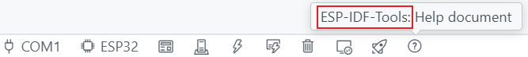

# 适用于VS Code的ESP-IDF开发辅助插件

此VScode插件的目的是：能让使用者在vscode更高效地开发乐鑫的esp-idf项目，可在Windows和Linux平台中使用。该插件可以很方便地对esp-idf项目进行：配置、构建、烧录、监控等操作。更多操作请参见乐鑫官方的[文档中心](https://docs.espressif.com/projects/esp-idf/zh_CN/latest/esp32/index.html)。

# 使用指南

使用指南[视频教程](https://space.bilibili.com/3546857808595431)。

## 安装

1. 下载并安装 [Visual Studio Code](https://code.visualstudio.com)。

2. 在操作系统中安装 ESP-IDF 所需的软件包：

    - 适用于 [MacOS 和 Linux](https://docs.espressif.com/projects/esp-idf/zh_CN/latest/esp32/get-started/linux-macos-setup.html) 的软件包。
    - 适用于[Windows的安装软件包](https://dl.espressif.com/dl/esp-idf/)。**注意，需要下载离线安装包进行安装**。

3. 如果你的是windows平台，请按照这里进行一些额外操作（[视频教程](https://space.bilibili.com/3546857808595431)）：

    在esp-idf的安装目录（默认是：`C:\Espressif`）创建该文件（或者在[这里](https://github.com/unkxTeam/vscode-esp-idf-tools-extension/assets)获取该文件）：`get_idf.bat`。打开该文件编辑内容为：
    ```shell
    idf_cmd_init.bat esp-idf-ad5d4ae340c39bc556afa783e091e773
    ```
    然后在环境变量的`path`中添加 `C:\Espressif`。

4. 如果你的是Mac或Linux平台，请复制并粘贴以下命令到 shell 配置文件中（`.profile`、`.bashrc`、`.zprofile` 等）：

    ```shell
    alias get_idf='. $HOME/esp/esp-idf/export.sh'
    ```

5. 打开 VS Code，点击左侧活动栏中的扩展图标，或使用**查看：显示扩展**命令（快捷键：<kbd>⇧</kbd><kbd>⌘</kbd><kbd>X</kbd> 或 <kbd>Ctrl+Shift+X</kbd>）。

6. 搜索 [ESP-IDF-Tools 扩展](https://marketplace.visualstudio.com/items?itemName=unkx.esp-idf-tools-extension)。

7. 安装上述扩展。安装成功后，当打开的项目是esp-idf工程时，vscode底部的状态栏会出现多个图标，根据需要点击使用即可。

    

**Enjoy!**
